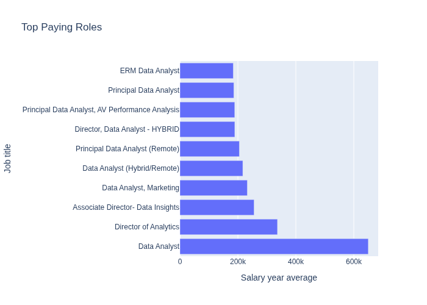
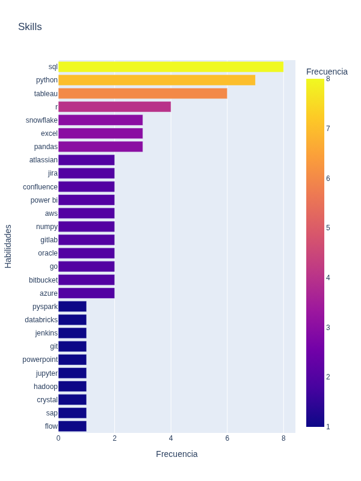
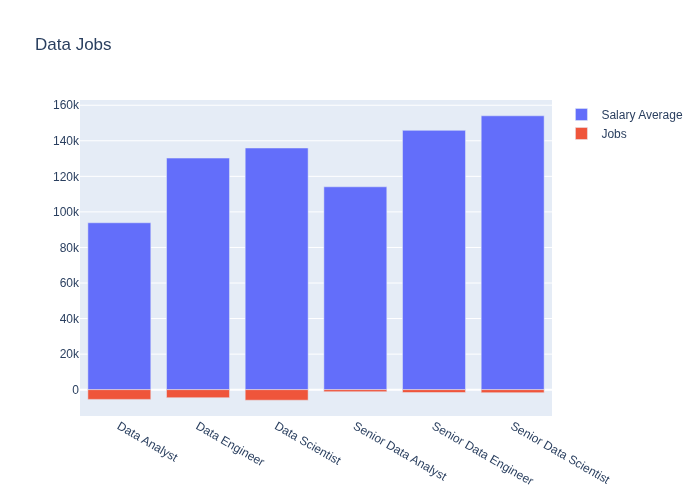

# Introducción
Este proyecto de análisis de datos con SQL explora el mercado laboral, centrándose específicamente en los roles de analista de datos, los trabajos mejor pagados, las habilidades más demandadas y su respectiva remuneración.

# Justificación
Este proyecto está inspirado en el "Optimal Skills Analysis" del [Curso de SQL](https://lukevarousse.com/sql) impartido por Luke Barousse, pero cuenta con modificaciones para ajustarse a un contexto propio.

El objetivo principal es demostrar las habilidades y conocimientos técnicos en SQL necesarios para el análisis de datos.

## Preguntas a responder a través de las consultas en SQL:
1. ¿Cuáles son los trabajos mejor pagados en el análisis de datos?
2. ¿Cuáles son las habilidades requeridas para esos trabajos?
3. ¿Cuáles son las habilidades más demandadas para esta área?
4. ¿Cómo se compara el análisis de datos frente a otros roles relacionados?

# Datos utilizados

Para la realización de este proyecto se utilizaron los conjuntos de datos almacenados en el siguiente enlace:
[Carpeta de Datos del Proyecto](https://drive.google.com/drive/folders/1moeWYoUtUklJO6NJdWo9OV8zWjRn0rjN)

# Herramientas utilizadas
Para el análisis de las ofertas laborales, se hizo uso de las siguientes herramientas:

- **SQL:** La herramienta principal del análisis, utilizada para consultar la base de datos y extraer información crítica.
- **MariaDB:** El sistema de gestión de bases de datos elegido, ideal para el manejo del volumen de las ofertas de trabajo.
- **DBeaver:** La interfaz elegida para la gestión de la base de datos y la ejecución de las consultas SQL.
- **Python:** Utilizado en conjunto con bibliotecas como Plotly para la visualización de los datos.
- **Git & GitHub:** Implementados para el control de versiones, compartir los scripts y darle seguimiento al proyecto.

# Análisis
Cada script de este proyecto tiene la finalidad de realizar una tarea específica, siguiendo la metodología estándar de análisis de datos.

## Limpieza de datos (Cleaning)
Se procedió a realizar una limpieza de los datos y a darles un formato adecuado para su posterior análisis.

1. Estandarizar los textos.
2. Convertir campos de texto vacíos a valores nulos (NULL).
3. Corregir los tipos de datos.
4. Identificar y eliminar duplicados.
5. Descartar datos innecesarios.

## Análisis de datos (Analysis)
Se creó una consulta (query) específica para responder a cada pregunta planteada.

### 1. Trabajos de análisis de datos mejor pagados
Para identificar los roles mejor remunerados, filtramos los trabajos específicos de análisis de datos e incluimos el salario promedio anual y su ubicación. El enfoque principal está en los trabajos remotos o aquellos ofertados en México.

```sql
SELECT
    job_id,
    job_title,
    job_location,
    job_schedule_type,
    salary_year_avg,
    job_posted_date,
    name AS company_name
FROM 
    job_postings_fact jpf 
LEFT JOIN company_dim cd ON jpf.company_id = cd.company_id 
WHERE
    job_title_short = 'Data Analyst' AND
    salary_year_avg IS NOT NULL AND
    (job_country  = 'Mexico' OR job_work_from_home = TRUE)
ORDER BY 
    salary_year_avg DESC
LIMIT 10;
```

Aquí está el desglose de los resultados:
- **Rango salarial amplio y elevado:** Los 10 principales trabajos de analista de datos ofrecen sueldos que van desde los $184,000 hasta los $650,000 dólares al año.
- **Diversidad de empresas:** Compañías como AT&T, Meta o Pinterest demuestran que existe interés en analistas de datos a través de diversas industrias.
- **Puestos de alto nivel:** Las empresas buscan profesionales para cargos directivos o principales (Principal Data Analyst), lo que demuestra la alta escalabilidad en este campo.



*Gráfico de barras que visualiza los salarios de los 10 mejores trabajos para análisis de datos, generado con Plotly.*

### 2. Habilidades requeridas para los trabajos mejor pagados
Para identificar estas habilidades, tomamos la consulta anterior y la unimos con la tabla de habilidades. De esta manera, obtenemos las competencias exigidas para cada una de estas ofertas top.

```sql
WITH top_paying_jobs AS (
    SELECT
        job_id,
        job_title,
        salary_year_avg,
        name AS company_name
    FROM 
        job_postings_fact jpf 
    LEFT JOIN company_dim cd ON jpf.company_id = cd.company_id 
    WHERE
        job_title_short = 'Data Analyst' AND
        salary_year_avg IS NOT NULL AND
        (job_country  = 'Mexico' OR job_work_from_home = TRUE)
    ORDER BY 
        salary_year_avg DESC
    LIMIT 10
)
SELECT 
    tpj.*, 
    sd.skills
FROM 
    top_paying_jobs tpj
INNER JOIN skills_job_dim sjd ON tpj.job_id = sjd.job_id
INNER JOIN skills_dim sd ON sjd.skill_id = sd.skill_id
ORDER BY
    tpj.salary_year_avg DESC;
```

Aquí está el desglose de los resultados:
- **SQL:** Se consagra como la habilidad más solicitada entre los trabajos con mejor sueldo.
- **Herramientas de gestión:** Competencias como Jira o Git también destacan como requisitos frecuentes para estos puestos.
- **Python:** Ocupa el segundo lugar en demanda. Además, bibliotecas específicas de Python como PySpark, Pandas y NumPy son altamente solicitadas, lo que subraya que el dominio de este lenguaje es aún más crucial de lo que aparenta.



*Gráfico de barras que visualiza las habilidades requeridas en los mejores trabajos para análisis de datos.*

### 3. ¿Cuáles son las habilidades más demandadas en el análisis de datos?
Para identificar la demanda general, filtramos las habilidades asociadas al rol de analista de datos y contamos cuántas ofertas de trabajo solicitan cada una.

```sql
WITH skills_ids AS (
SELECT skill_id
FROM skills_job_dim sjd
WHERE job_id IN (
    SELECT jpf.job_id 
    FROM job_postings_fact jpf 
    WHERE jpf.job_title_short = 'Data Analyst'
)
)
SELECT sd.skills, COUNT(sd.skill_id) AS demand_count
FROM skills_ids si
INNER JOIN skills_dim sd ON si.skill_id = sd.skill_id
GROUP BY sd.skills
ORDER BY demand_count DESC
LIMIT 5;
```

Aquí está el desglose de los resultados:
- **Fundamentales:** **SQL** y **Excel** siguen siendo los pilares más populares en el análisis de datos.
- **Visualización:** **Tableau** y **Power BI** son herramientas esenciales gracias a su facilidad para generar tableros interactivos (dashboards).
- **Python:** Se confirma la creciente importancia de este lenguaje y su ecosistema de bibliotecas.

| Skills  | Demand Count |
|---------|--------------|
| SQL     | 92,628       |
| Excel   | 67,031       |
| Python  | 57,326       |
| Tableau | 46,554       |
| PowerBI | 39,468       |

*Tabla de las 5 habilidades más demandadas en el análisis de datos.*

### 4. ¿Cómo se compara el análisis de datos frente a otros roles relacionados?
Filtraremos los trabajos que contengan la palabra "Data" en su título (Data Engineer, Data Scientist, etc.) para comparar el volumen de ofertas y sus salarios promedio.

```sql
SELECT 
    job_title_short,
    COUNT(job_title) AS job_count,
    ROUND(AVG(salary_year_avg)) AS salary_avg
FROM 
    job_postings_fact jpf
WHERE 
    salary_year_avg IS NOT NULL AND 
    job_title_short LIKE '%Data%'
GROUP BY
    job_title_short;
```

Aquí está el desglose de los resultados:
- **Data Scientist:** Se posiciona como el rol más demandado por las empresas y también el mejor pagado.
- **Data Engineer:** Sigue muy de cerca a los puestos de Data Scientist, tanto en volumen de demanda como en remuneración.
- **Nivel Senior:** Existe una diferencia notoria en la cantidad de ofertas de trabajo disponibles en comparación con la poca brecha salarial que existe entre niveles de experiencia.



*Gráfico de barras que compara el sueldo anual promedio frente al volumen de ofertas laborales para distintos trabajos relacionados con datos.*

# Hallazgos clave (Insights)
- **El rey de los datos:** SQL sigue siendo la herramienta más solicitada e indispensable para los analistas de datos, especialmente en los puestos mejor remunerados.
- **El valor de Python:** El dominio de Python, junto con bibliotecas como Pandas y NumPy, actúa como un gran diferenciador salarial.
- **La evolución del rol:** Roles más avanzados como *Data Scientist* o *Data Engineer* ofrecen salarios más altos, pero la demanda base para *Data Analysts* sigue siendo sumamente sólida.
- **Visualización indispensable:** Las herramientas como Tableau y Power BI no son opcionales; son un requisito estándar para comunicar resultados de manera efectiva a los interesados.

# Qué aprendí
Durante el desarrollo de este proyecto, logré:
- **Estructuración de bases de datos:** Mejorar mi capacidad para configurar, gestionar y consultar bases de datos relacionales utilizando MariaDB y DBeaver.
- **Consultas complejas (CTEs y Joins):** Perfeccionar mi uso de *Common Table Expressions* (CTEs) y múltiples cláusulas `JOIN` para extraer y relacionar datos de manera eficiente.
- **Análisis crítico:** Desarrollar una perspectiva analítica más aguda para traducir preguntas de negocio abstractas en consultas SQL concretas y funcionales.
- **Flujo de trabajo integral:** Dominar un flujo de trabajo profesional que abarca desde la limpieza de datos (*Data Cleaning*) hasta la visualización y el control de versiones con Git/GitHub.

# Conclusiones
El mercado laboral para los profesionales de los datos es altamente competitivo y al mismo tiempo muy gratificante. Para destacar como analista de datos, no basta con saber extraer información; es necesario dominar la trinidad de las herramientas modernas: SQL para la consulta, Python para el análisis programático profundo y herramientas de BI (Tableau/Power BI) para la narración visual (*storytelling*). Este análisis valida que enfocar el aprendizaje en estas tecnologías específicas ofrece el mejor retorno de inversión a nivel profesional.

## Pensamientos finales (Closing Thoughts)

Este proyecto mejoró significativamente mis habilidades en SQL y me brindó conocimientos invaluables sobre el panorama actual del análisis de datos.
